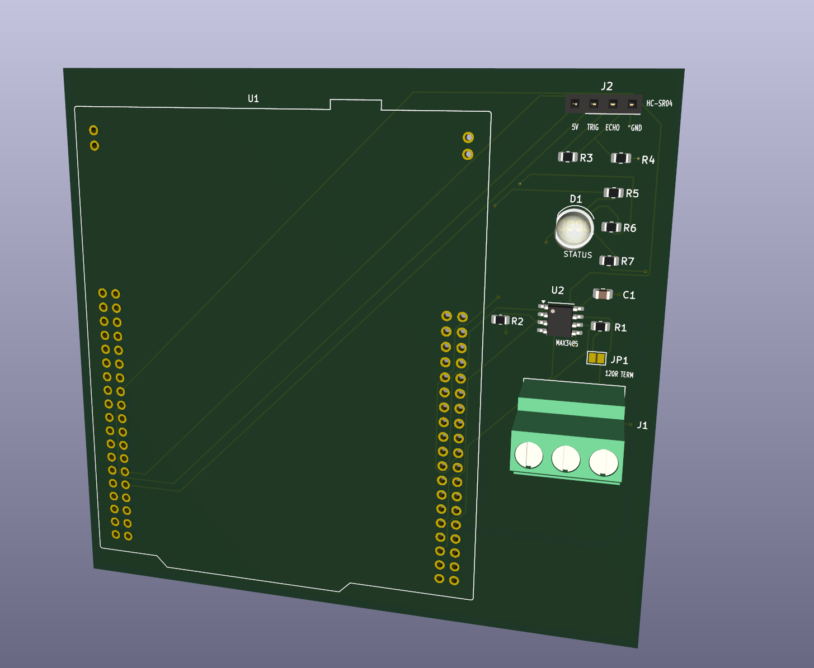
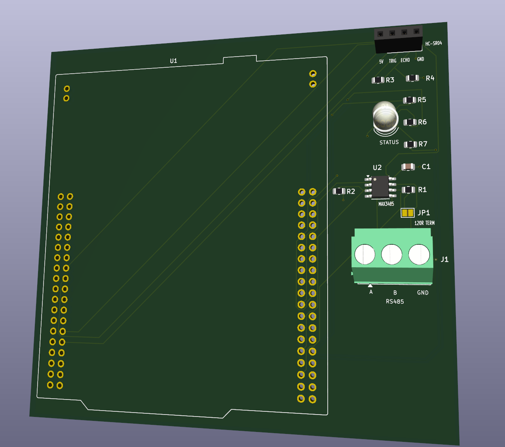

# STM32F411RE Parking Sensor Node

STM32F411RE 기반으로 초음파 거리 측정, 주차 상태 판정, RGB LED 표시, Modbus RTU/RS485 통신을 구현한 주차 센서 노드 프로젝트입니다.

HC-SR04의 Echo pulse를 Timer Input Capture로 비동기 측정하고, 측정 결과에 hysteresis와 entry/exit delay를 적용해 `FREE / OCCUPIED / ERROR` 상태를 판정합니다.

센서 상태와 설정값은 Modbus Holding Register에 매핑했으며, `0x03 Read Holding Registers`와 `0x06 Write Single Register`를 통해 외부 Modbus Master에서 조회 및 변경할 수 있도록 구현했습니다.

현재 브레드보드 환경에서 펌웨어와 RS485 통신 검증을 완료했으며, NUCLEO-F411RE용 Carrier PCB도 Gerber/Drill 파일 생성 단계까지 완료했습니다. 실제 PCB 제작과 Bring-up은 다음 단계로 진행할 예정입니다.

## Project Status

- [x] Pin Map 정의
- [x] HC-SR04 거리 측정
- [x] TIM2 Input Capture / Interrupt 처리
- [x] 거리 측정 Timeout / Error Counter
- [x] FREE / OCCUPIED / ERROR 상태 판정
- [x] Hysteresis / Entry Delay / Exit Delay
- [x] RGB LED 상태 표시
- [x] Modbus RTU Function `0x03`
- [x] Modbus RTU Function `0x06`
- [x] Runtime Configuration
- [x] Modbus Exception Response
- [x] RS485 실통신 검증
- [x] Carrier PCB Schematic
- [x] Carrier PCB Layout / Routing
- [x] Carrier PCB ERC / DRC Verification
- [x] Gerber / Drill File Generation & Inspection
- [x] MAX3485용 PB5 DE/RE 제어 펌웨어 반영
- [ ] UART CLI
- [ ] PCB Fabrication
- [ ] PCB Bring-up / Hardware Verification

## System Overview

전체 데이터 흐름은 다음과 같습니다.

```text
HC-SR04
   │
   │ Echo Pulse
   ↓
TIM2 Input Capture
   │
   ↓
Distance Measurement
   │
   ↓
Parking State Logic
FREE / OCCUPIED / ERROR
   │
   ├──────────────→ RGB LED
   │
   ↓
Modbus Register Layer
   │
   ↓
Modbus RTU
   │
   ↓
USART1 / RS485
   │
   ↓
External Modbus Master
```

HC-SR04의 Echo pulse는 `TIM2_CH1 Input Capture`로 측정합니다.

측정된 거리 값은 주차 상태 판정 로직으로 전달되며, hysteresis와 entry/exit delay를 적용해 순간적인 거리 변화로 상태가 불필요하게 전환되는 것을 줄였습니다.

판정 결과와 센서 상태, 오류 카운터, 설정값은 Modbus Holding Register에 매핑해 외부 Master에서 확인할 수 있도록 구성했습니다.

## Hardware

### MCU / Development Board

- MCU: STM32F411RET6
- Board: NUCLEO-F411RE
- System Clock: 84 MHz

### Sensor / Indicator

- Distance Sensor: HC-SR04
- Status Indicator: Common Cathode RGB LED
- HC-SR04 Echo Interface: 1 kΩ / 2 kΩ Voltage Divider

### Communication

- Modbus UART: USART1
- Debug UART: USART2 / ST-LINK VCP
- Protocol: Modbus RTU
- Prototype RS485: Auto-direction TTL-to-RS485 Module
- Carrier PCB RS485: MAX3485
- PC Interface: USB-to-RS485 Adapter

상세 핀 구성은 아래 문서를 참고합니다.

- [Pin Map](docs/pin_map.md)

## HC-SR04 Distance Measurement

HC-SR04의 Trigger 신호를 출력한 뒤 Echo pulse의 High 구간을 측정해 거리를 계산합니다.

Echo 입력은 `PA0 / TIM2_CH1`에 연결하고, Timer를 1 MHz로 설정해 1 us 단위로 pulse width를 측정합니다.

```text
IDLE
  ↓
Trigger Pulse
  ↓
WAIT_RISING
  ↓
Rising Edge Capture
  ↓
WAIT_FALLING
  ↓
Falling Edge Capture
  ↓
Pulse Width Calculation
  ↓
DATA_READY
```

거리 계산에는 다음 관계를 사용합니다.

```text
Distance_mm = PulseWidth_us × 343 / 2000
```

센서 측정 범위는 약 `20 ~ 4000 mm`로 제한하며, 범위를 벗어난 pulse는 Invalid Pulse로 처리합니다.

정상적인 Echo 신호가 들어오지 않을 경우 무한 대기하지 않도록 Timeout을 적용했습니다.

구분하는 오류 항목은 다음과 같습니다.

- Rising Edge Timeout
- Falling Edge Timeout
- Invalid Pulse

각 오류는 별도의 Counter로 기록해 Modbus를 통해 확인할 수 있습니다.

## Parking State Logic

주차 상태는 다음 세 가지로 구분합니다.

| Value | State | Description |
|---:|---|---|
| `0` | FREE | 주차 공간이 비어 있는 상태 |
| `1` | OCCUPIED | 차량이 감지된 상태 |
| `2` | ERROR | 거리 측정이 일정 시간 이상 유효하지 않은 상태 |

기본 설정값은 다음과 같습니다.

```text
Occupied Threshold = 500 mm
Hysteresis         = 50 mm
Entry Delay        = 500 ms
Exit Delay         = 1000 ms
```

FREE 상태에서 거리가 `Occupied Threshold` 이하로 Entry Delay 동안 유지되면 OCCUPIED로 전환됩니다.

OCCUPIED 상태에서는 다음 기준을 사용합니다.

```text
Free Threshold =
    Occupied Threshold + Hysteresis
```

기본값 기준으로:

```text
Occupied Threshold = 500 mm
Free Threshold     = 550 mm
```

이므로 `500 mm < distance <= 550 mm` 구간에서는 현재 상태를 유지합니다.

따라서 임계값 부근에서 측정값이 흔들려도 상태가 즉시 반복 전환되지 않습니다.

거리 측정이 일정 시간 이상 유효하지 않을 경우 ERROR 상태로 전환합니다.

## RGB LED

주차 상태는 RGB LED로 표시합니다.

| Parking State | LED |
|---|---|
| FREE | Green |
| OCCUPIED | Red |
| ERROR | Blue |

GPIO 구성:

```text
PB12 → Red
PB13 → Green
PB14 → Blue
```

RGB LED는 Active High 방식으로 제어합니다.

## Modbus RTU / RS485

외부 장치에서 센서 상태와 설정값을 확인하거나 변경할 수 있도록 Modbus RTU Slave를 구현했습니다.

지원하는 Function Code는 다음과 같습니다.

- `0x03` Read Holding Registers
- `0x06` Write Single Register

통신 설정:

- Slave ID: `1`
- Baud Rate: `115200`
- Format: `8-N-1`
- Interface: USART1 / RS485

### Prototype RS485

브레드보드 프로토타입에서는 자동 방향 제어 TTL-to-RS485 모듈을 사용했습니다.

```text
PA9  / USART1_TX  → RS485 Module RXD
PA10 / USART1_RX  ← RS485 Module TXD
```

모듈 내부에서 송수신 방향을 자동으로 전환하므로 별도의 DE/RE GPIO가 필요하지 않습니다.

### Carrier PCB RS485

Carrier PCB에서는 `MAX3485`를 사용합니다.

```text
PA9  / USART1_TX  → MAX3485 DI
PA10 / USART1_RX  ← MAX3485 RO
PB5               → MAX3485 DE + /RE
```

`DE`와 `/RE`는 하나의 GPIO로 묶어 다음과 같이 제어합니다.

```text
PB5 LOW  → Receive Mode
PB5 HIGH → Transmit Mode
```

Modbus 응답을 송신하기 직전에 PB5를 HIGH로 설정하고, `HAL_UART_Transmit()` 완료 후 LOW로 복귀시켜 다시 Receive Mode로 전환합니다.

PCB에는 PB5에 10 kΩ Pull-down 저항을 적용해 MCU Reset 중에도 기본적으로 Driver가 비활성화되고 Receiver가 활성화되도록 구성했습니다.

브레드보드의 자동 방향 제어 모듈에는 PB5가 연결되지 않으므로, 해당 제어 코드를 추가한 뒤에도 기존 Prototype의 FC03 / FC06 통신이 정상적으로 동작하는 것을 확인했습니다.

## Holding Register Map

| Address | Name | Access |
|---|---|---|
| `0x0000` | Distance_mm | R |
| `0x0001` | Parking_State | R |
| `0x0002` | Status_Flags | R |
| `0x0003` | Total_Error_Count | R |
| `0x0004` | Rising_Timeout_Count | R |
| `0x0005` | Falling_Timeout_Count | R |
| `0x0006` | Invalid_Pulse_Count | R |
| `0x0007` | Occupied_Threshold_mm | R/W |
| `0x0008` | Hysteresis_mm | R/W |
| `0x0009` | Entry_Delay_ms | R/W |
| `0x000A` | Exit_Delay_ms | R/W |

상세한 Register Map과 설정값 검증 규칙은 아래 문서에 정리했습니다.

- [Modbus Register Map](docs/register_map.md)

## Runtime Configuration

`0x0007`~`0x000A` Register는 Modbus `0x06 Write Single Register`를 통해 실행 중에 변경할 수 있습니다.

예를 들어 Occupied Threshold의 기본값은 500 mm입니다.

```text
Register: 0x0007

500 mm
0x01F4

      ↓ FC06

300 mm
0x012C
```

설정값을 변경하면 주차 상태 판정 로직에서 즉시 새로운 값을 사용합니다.

현재 설정값은 RAM에만 저장되므로 Reset 또는 전원 재인가 후에는 기본값으로 돌아갑니다.

## Modbus Exception Handling

지원하지 않는 요청이나 잘못된 설정값에는 Modbus Exception Response를 반환합니다.

| Exception | Description |
|---|---|
| `0x01` | Illegal Function |
| `0x02` | Illegal Data Address |
| `0x03` | Illegal Data Value |

예를 들어 읽기 전용 Register인 `0x0000`에 `0x06` Write 요청을 보내면 `0x02 Illegal Data Address`를 반환합니다.

허용 범위를 벗어난 Occupied Threshold를 설정하면 `0x03 Illegal Data Value`를 반환합니다.

## Verification

### FC03 — Holding Register Read

Modbus Client에서 `0x0000`~`0x000A` Register를 한 번에 읽어 거리, 주차 상태, 오류 카운터, 설정값을 확인했습니다.


### Request / Response Frame

UART Debug 출력을 통해 실제 Modbus RTU Request와 Response 데이터를 확인했습니다.


### FC06 — Runtime Threshold Change

Occupied Threshold를 `500 mm`에서 `300 mm`로 변경한 뒤 Write 결과와 실제 주차 상태 전환 기준 변경을 확인했습니다.


### Exception — Illegal Data Address

읽기 전용 Register에 Write 요청을 전송해 `0x02 Illegal Data Address` 응답을 확인했습니다.


### Exception — Illegal Data Value

허용 범위를 벗어난 설정값을 전송해 `0x03 Illegal Data Value` 응답을 확인했습니다.


## Carrier PCB Design

브레드보드 프로토타입을 실제 조립 가능한 구조로 확장하기 위해 NUCLEO-F411RE용 Carrier PCB를 KiCad로 설계했습니다.

Carrier PCB에는 다음 회로를 포함합니다.

- NUCLEO-F411RE Interface
- HC-SR04 Connector
- HC-SR04 Echo Voltage Divider
- RGB Status LED
- MAX3485 RS485 Transceiver
- MAX3485 100 nF Decoupling Capacitor
- PB5 DE/RE Pull-down
- RS485 A / B / GND Terminal Block
- Selectable 120 Ω RS485 Termination

RS485 종단저항은 Solder Jumper를 사용해 필요할 때만 활성화할 수 있도록 구성했습니다.

```text
RS485_A ── 120 Ω ── JP1 ── RS485_B
```

### PCB 3D Overview



### RS485 / Sensor Section



PCB는 2-Layer로 구성했으며, B.Cu에 GND Copper Zone을 적용했습니다. ERC와 DRC는 모두 Error / Warning 0건을 확인했습니다.

구매한 Common Cathode RGB LED의 `B-G-K-R` Pin Order에 맞춰 전용 Footprint를 추가하고, D1의 Drill Diameter를 `0.8 mm`로 조정해 Annular Ring 규칙을 만족시켰습니다.

이후 Gerber와 PTH / NPTH Drill File을 생성하고 KiCad Gerber Viewer에서 Edge.Cuts, Copper, Solder Mask, Silkscreen, Drill Layer를 확인했습니다.

KiCad 프로젝트와 제조용 출력 파일은 다음 경로에 포함되어 있습니다.

```text
hardware/
└─ parking_sensor_node/
   ├─ parking_sensor_node.kicad_pro
   ├─ parking_sensor_node.kicad_sch
   ├─ parking_sensor_node.kicad_pcb
   ├─ fp-lib-table
   ├─ footprints/
   │  └─ ParkingSensor.pretty/
   │     └─ LED_D5.0mm-4_RGB_BGKR.kicad_mod
   └─ gerber/
      ├─ *.gbr
      ├─ *-PTH.drl
      └─ *-NPTH.drl
```

## Software Structure

주요 모듈은 다음과 같이 분리했습니다.

```text
Core/
├─ Inc/
│  ├─ hcsr04.h
│  ├─ parking_logic.h
│  ├─ rgb_led.h
│  ├─ app_config.h
│  ├─ modbus_crc.h
│  ├─ modbus_registers.h
│  └─ modbus_rtu.h
│
└─ Src/
   ├─ hcsr04.c
   ├─ parking_logic.c
   ├─ rgb_led.c
   ├─ app_config.c
   ├─ modbus_crc.c
   ├─ modbus_registers.c
   └─ modbus_rtu.c
```

각 모듈의 역할을 분리해 센서 측정, 상태 판정, 설정값 관리, Register Mapping, Modbus Frame 처리가 서로 직접 의존하지 않도록 구성했습니다.

## Current Limitations

현재 구현은 프로젝트 범위에 맞춰 다음과 같이 제한되어 있습니다.

- Modbus Function `0x03`, `0x06`만 지원
- UART RX는 현재 지원하는 8-byte Request Frame을 기준으로 처리
- Generic Modbus RTU Frame Gap Detection 미구현
- 통신 중 Partial Frame이 남은 상태에서 Master가 재연결될 경우 Frame 정렬이 깨질 수 있음
- 설정값은 RAM에만 저장
- UART CLI 미구현
- Carrier PCB 실물 제작 및 Bring-up 미완료
- MAX3485 기반 수동 DE/RE 제어는 펌웨어에 반영했으나 실제 Carrier PCB에서의 Hardware Verification은 아직 진행 전

현재 브레드보드 환경에서는 센서 측정, 상태 판정, RGB 표시, Modbus FC03 / FC06, Exception Response 및 RS485 실통신까지 검증했습니다.

## Next Step

다음 단계에서는 구매한 부품이 도착한 뒤 실제 부품과 Footprint를 대조하고 Carrier PCB 제작 및 Bring-up을 진행합니다.

제작 전 실물 기준으로 다음 항목을 확인할 예정입니다.

- MAX3485 SOIC-8 Package
- 3-pin RS485 Terminal Block의 5.08 mm Pitch / 방향
- RGB LED의 실제 Pin Order / Lead Pitch
- HC-SR04 Connector 및 기구 간섭

PCB 제작 후에는 다음 항목을 검증할 예정입니다.

```text
Power / Ground
    ↓
HC-SR04 Measurement
    ↓
RGB State Output
    ↓
MAX3485 DE/RE Control
    ↓
Modbus FC03 / FC06
    ↓
Exception Response
    ↓
Long-term Communication Test
```

PCB 제작 후에는 브레드보드에서 검증한 기능을 Carrier PCB에서도 동일한 순서로 Bring-up할 예정입니다.