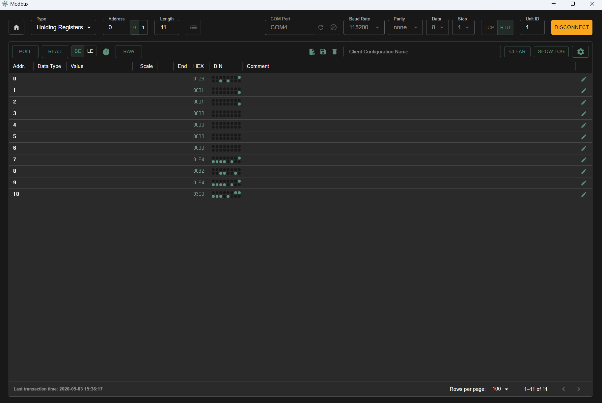
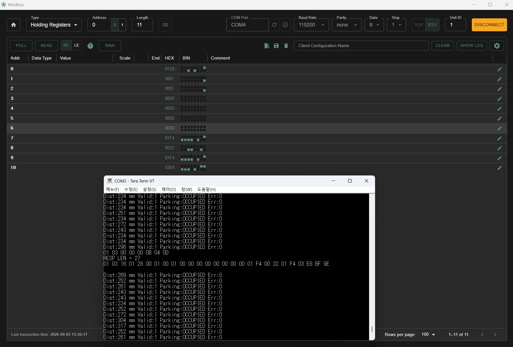
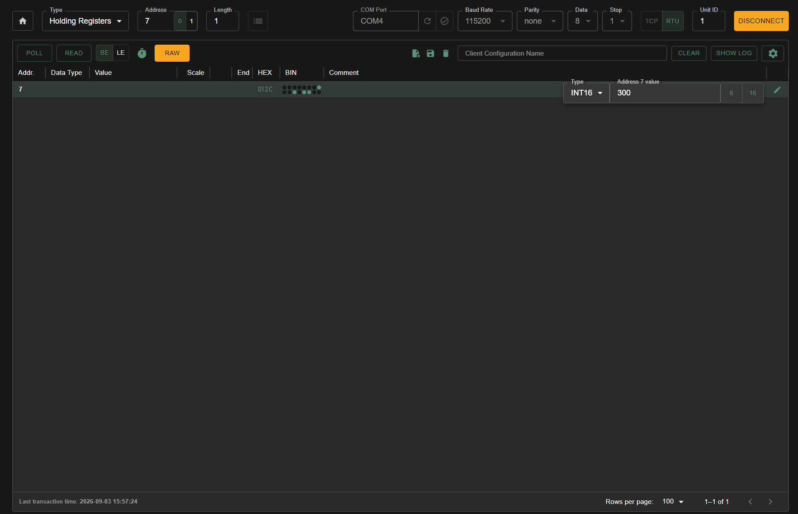
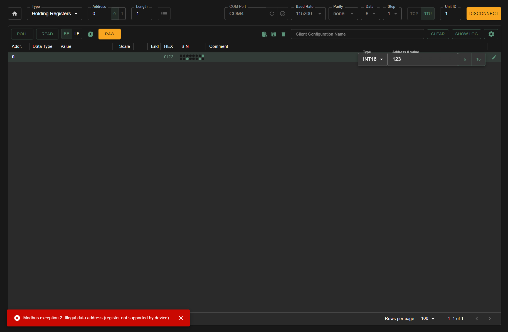
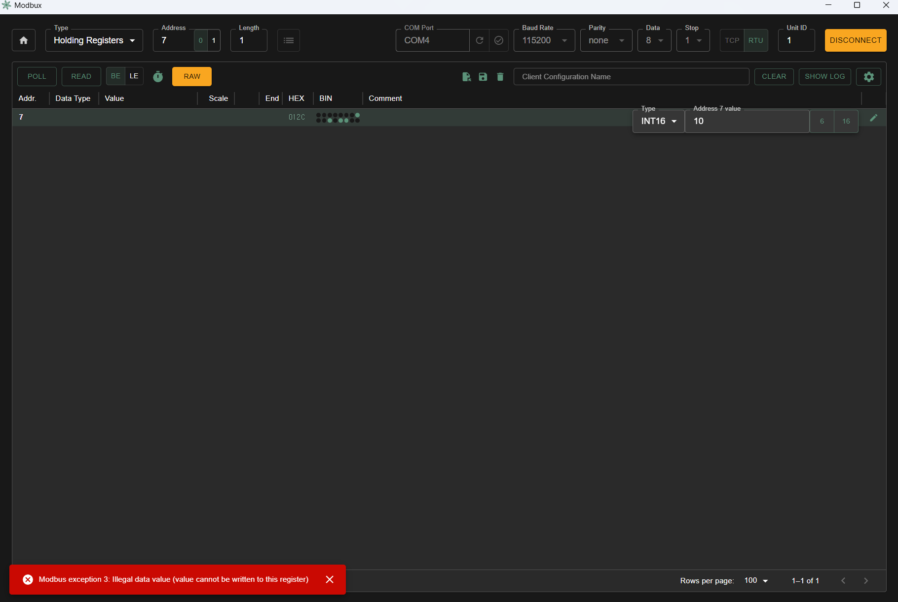

# STM32F411RE Parking Sensor Node

STM32F411RE 기반으로 초음파 거리 측정, 주차 상태 판정, RGB LED 표시, Modbus RTU/RS485 통신을 구현하는 주차 센서 노드 프로젝트입니다.

현재는 **MCU 펌웨어 및 RS485 통신 검증 단계까지 완료**했으며, 이후 Carrier PCB 설계와 보드 Bring-up을 진행할 예정입니다.

## Project Status

- [x] Pin Map 정의
- [x] HC-SR04 거리 측정
- [x] TIM Input Capture / Interrupt 처리
- [x] 거리 측정 Timeout / Error Counter
- [x] FREE / OCCUPIED / ERROR 상태 판정
- [x] Hysteresis / Entry Delay / Exit Delay
- [x] RGB LED 상태 표시
- [x] Modbus RTU Function `0x03`
- [x] Modbus RTU Function `0x06`
- [x] Runtime Configuration
- [x] Modbus Exception Response
- [x] RS485 실통신 검증
- [ ] UART CLI
- [ ] Carrier PCB Schematic / Layout
- [ ] PCB Bring-up

## System Overview

전체 데이터 흐름은 다음과 같습니다.

```text
HC-SR04
   │
   │ Echo Pulse
   ↓
TIM2 Input Capture
   │
   ↓
Distance Measurement
   │
   ↓
Parking State Logic
FREE / OCCUPIED / ERROR
   │
   ├──────────────→ RGB LED
   │
   ↓
Modbus Register Layer
   │
   ↓
Modbus RTU
   │
   ↓
USART1 / RS485
   │
   ↓
External Modbus Master
```

HC-SR04의 Echo pulse는 `TIM2_CH1 Input Capture`로 측정합니다.

측정된 거리 값은 주차 상태 판정 로직으로 전달되며, hysteresis와 entry/exit delay를 적용해 순간적인 거리 변화로 상태가 불필요하게 전환되는 것을 줄였습니다.

판정 결과와 센서 상태, 오류 카운터, 설정값은 Modbus Holding Register에 매핑해 외부 Master에서 확인할 수 있도록 구성했습니다.

## Hardware

- MCU: STM32F411RET6
- Board: NUCLEO-F411RE
- Distance Sensor: HC-SR04
- Status Indicator: RGB LED
- Communication: USART1 / RS485
- Debug Interface: USART2 / ST-LINK VCP
- RS485 Interface: Auto-direction TTL-to-RS485 Module
- PC Interface: USB-to-RS485 Adapter

상세 핀 구성은 아래 문서를 참고합니다.

- [Pin Map](docs/pin_map.md)

## HC-SR04 Distance Measurement

HC-SR04의 Trigger 신호를 출력한 뒤 Echo pulse의 High 구간을 측정해 거리를 계산합니다.

Echo 입력은 `PA0 / TIM2_CH1`에 연결하고, Timer를 1 MHz로 설정해 1 us 단위로 pulse width를 측정합니다.

측정 과정은 다음과 같습니다.

```text
IDLE
  ↓
Trigger Pulse
  ↓
WAIT_RISING
  ↓
Rising Edge Capture
  ↓
WAIT_FALLING
  ↓
Falling Edge Capture
  ↓
Pulse Width Calculation
  ↓
DATA_READY
```

정상적인 Echo 신호가 들어오지 않을 경우 무한 대기하지 않도록 Timeout을 적용했습니다.

구분하는 오류 항목은 다음과 같습니다.

- Rising Edge Timeout
- Falling Edge Timeout
- Invalid Pulse

각 오류는 별도의 Counter로 기록해 Modbus를 통해 확인할 수 있습니다.

## Parking State Logic

주차 상태는 다음 세 가지로 구분합니다.

| Value | State | Description |
|---:|---|---|
| `0` | FREE | 주차 공간이 비어 있는 상태 |
| `1` | OCCUPIED | 차량이 감지된 상태 |
| `2` | ERROR | 거리 측정이 일정 시간 이상 유효하지 않은 상태 |

기본 설정값은 다음과 같습니다.

```text
Occupied Threshold = 500 mm
Hysteresis         = 50 mm
Entry Delay        = 500 ms
Exit Delay         = 1000 ms
```

FREE 상태에서 거리가 `Occupied Threshold` 이하로 일정 시간 유지되면 OCCUPIED로 전환됩니다.

OCCUPIED 상태에서는 다음 기준을 사용합니다.

```text
Free Threshold =
    Occupied Threshold + Hysteresis
```

기본값 기준으로 `500 mm < distance <= 550 mm` 구간에서는 현재 상태를 유지합니다.

이를 통해 임계값 주변에서 측정값이 반복적으로 변할 때 상태가 빠르게 전환되는 현상을 줄였습니다.

## RGB LED

주차 상태는 RGB LED로도 확인할 수 있습니다.

| Parking State | LED |
|---|---|
| FREE | Green |
| OCCUPIED | Red |
| ERROR | Blue |

- PB12: Red
- PB13: Green
- PB14: Blue

## Modbus RTU / RS485

외부 장치에서 센서 상태와 설정값을 확인하거나 변경할 수 있도록 Modbus RTU Slave를 구현했습니다.

현재 지원하는 Function Code는 다음과 같습니다.

- `0x03` Read Holding Registers
- `0x06` Write Single Register

통신 설정:

- Slave ID: `1`
- Baud Rate: `115200`
- Format: `8-N-1`
- Interface: USART1 / RS485

현재 프로토타입에서는 자동 방향 제어 RS485 모듈을 사용하므로 MCU에서 별도의 `DE/RE` 신호를 제어하지 않습니다.

## Holding Register Map

| Address | Name | Access |
|---|---|---|
| `0x0000` | Distance_mm | R |
| `0x0001` | Parking_State | R |
| `0x0002` | Status_Flags | R |
| `0x0003` | Total_Error_Count | R |
| `0x0004` | Rising_Timeout_Count | R |
| `0x0005` | Falling_Timeout_Count | R |
| `0x0006` | Invalid_Pulse_Count | R |
| `0x0007` | Occupied_Threshold_mm | R/W |
| `0x0008` | Hysteresis_mm | R/W |
| `0x0009` | Entry_Delay_ms | R/W |
| `0x000A` | Exit_Delay_ms | R/W |

상세한 Register Map과 설정값 검증 규칙은 아래 문서에 정리했습니다.

- [Modbus Register Map](docs/register_map.md)

## Runtime Configuration

`0x0007`~`0x000A` Register는 Modbus `0x06 Write Single Register`를 통해 실행 중에 변경할 수 있습니다.

예를 들어 Occupied Threshold의 기본값은 500 mm입니다.

```text
Register: 0x0007

500 mm
0x01F4

      ↓ FC06

300 mm
0x012C
```

설정값을 변경하면 주차 상태 판정 로직에서 즉시 새로운 값을 사용합니다.

현재 설정값은 RAM에만 저장되므로 Reset 또는 전원 재인가 후에는 기본값으로 돌아갑니다.

## Modbus Exception Handling

지원하지 않는 요청이나 잘못된 설정값에는 Modbus Exception Response를 반환합니다.

| Exception | Description |
|---|---|
| `0x01` | Illegal Function |
| `0x02` | Illegal Data Address |
| `0x03` | Illegal Data Value |

예를 들어 읽기 전용 Register인 `0x0000`에 `0x06` Write 요청을 보내면 `0x02 Illegal Data Address`를 반환합니다.

허용 범위를 벗어난 Occupied Threshold를 설정하면 `0x03 Illegal Data Value`를 반환합니다.

## Verification

### FC03 — Holding Register Read

Modbus Client에서 `0x0000`~`0x000A` Register를 한 번에 읽어 거리, 주차 상태, 오류 카운터, 설정값을 확인했습니다.



### Request / Response Frame

UART Debug 출력을 통해 실제 Modbus RTU Request와 Response 데이터를 확인했습니다.



### FC06 — Runtime Threshold Change

Occupied Threshold를 `500 mm`에서 `300 mm`로 변경한 뒤 실제 주차 상태 전환 기준이 변경되는 것을 확인했습니다.



### Exception — Illegal Data Address

읽기 전용 Register에 Write 요청을 전송해 `0x02 Illegal Data Address` 응답을 확인했습니다.



### Exception — Illegal Data Value

허용 범위를 벗어난 설정값을 전송해 `0x03 Illegal Data Value` 응답을 확인했습니다.



## Software Structure

주요 모듈은 다음과 같이 분리했습니다.

```text
Core/
├─ Inc/
│  ├─ hcsr04.h
│  ├─ parking_logic.h
│  ├─ rgb_led.h
│  ├─ app_config.h
│  ├─ modbus_crc.h
│  ├─ modbus_registers.h
│  └─ modbus_rtu.h
│
└─ Src/
   ├─ hcsr04.c
   ├─ parking_logic.c
   ├─ rgb_led.c
   ├─ app_config.c
   ├─ modbus_crc.c
   ├─ modbus_registers.c
   └─ modbus_rtu.c
```

각 모듈의 역할을 분리해 센서 측정, 상태 판정, 설정값 관리, Register Mapping, Modbus Frame 처리가 서로 직접 의존하지 않도록 구성했습니다.

## Current Limitations

현재 구현은 프로젝트 범위에 맞춰 다음과 같이 제한되어 있습니다.

- Modbus Function `0x03`, `0x06`만 지원
- UART RX는 현재 지원하는 8-byte Request Frame을 기준으로 처리
- Generic Modbus RTU Frame Gap Detection 미구현
- 설정값은 RAM에만 저장
- UART CLI 미구현
- Carrier PCB 미제작

현재 단계에서는 센서 측정 → 상태 판정 → Modbus 통신까지의 MCU 펌웨어 동작과 RS485 실통신 검증에 초점을 맞췄습니다.

## Next Step

다음 단계에서는 현재 브레드보드 프로토타입을 기준으로 Carrier PCB를 설계할 예정입니다.

PCB 설계 과정에서는 다음 항목을 검토합니다.

- HC-SR04 Interface
- RGB LED Interface
- RS485 Transceiver
- Power / Ground
- Connector 배치
- Debug / Programming Interface

최종 RS485 Transceiver 구성에 따라 `DE/RE` 제어 GPIO를 추가할 수 있습니다.